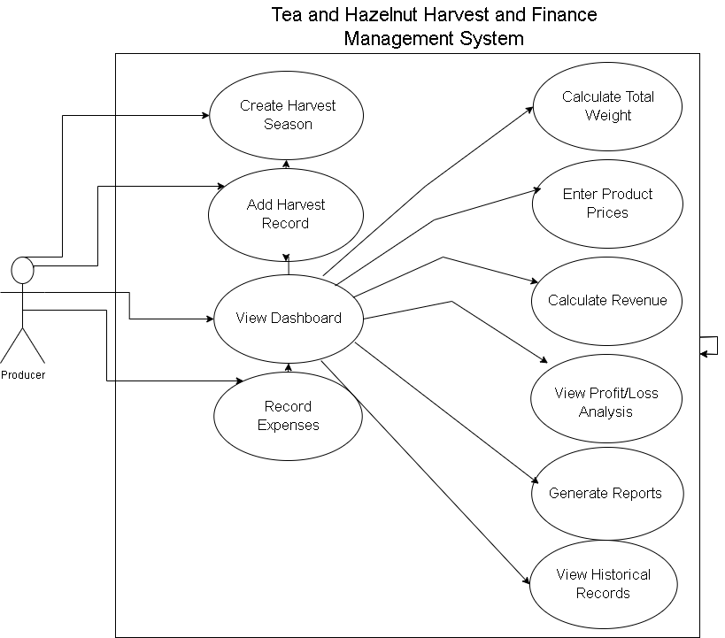
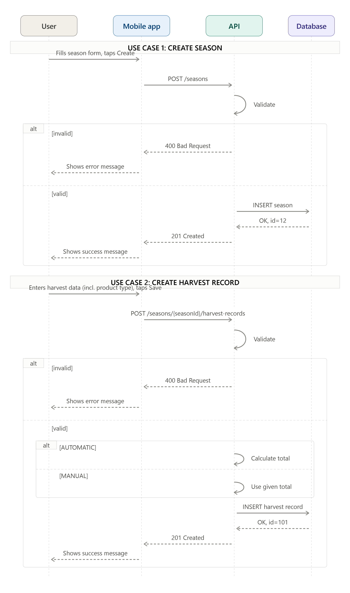
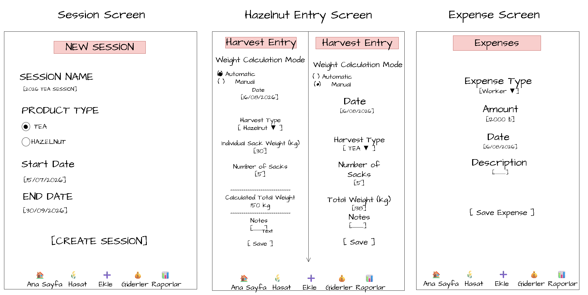
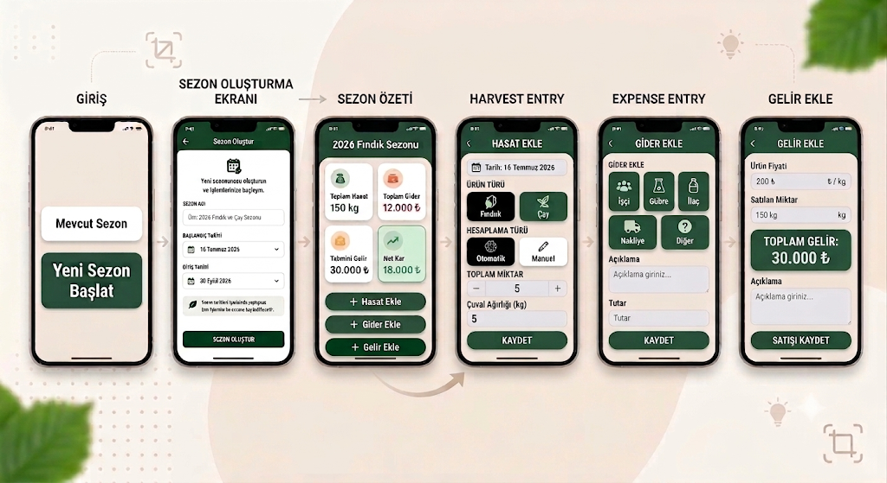

# Tea-Hazelnut-Harvest-Management-App

An application for tea and hazelnut producers to manage and track harvests, income, and expenses. Designed to be simple enough for users aged 60+ — no login required, data stored locally on the device.

## Overview

Producers currently track harvests, expenses, and earnings using notebooks or spreadsheets, which leads to data loss and calculation errors. This app lets producers record harvest amounts, expenses, and sales per season, and automatically calculates total weight, revenue, and profit/loss.

## Features

- Create and manage harvest seasons (name, product type, start/end date)
- Record daily harvest data, with automatic or manual weight calculation
- Record expenses (labor, fertilizer, pesticide, fuel, other)
- Record sales with automatic revenue calculation
- View a season summary dashboard (total harvest, expenses, revenue, net profit)
- Works offline — all data is stored locally on the device

## Documents

- [Requirements](Requirement.md)
- [User Stories](user%20story.md)
- [Use Case Diagram](docs/use-case-diagram.md)
- [Sequence Diagrams](docs/sequence-diagram.md)
- [API Design (OpenAPI)](openapi.yaml) — paste the contents into [editor.swagger.io](https://editor.swagger.io) to view it interactively

## Use Case Diagram

## Sequence Diagrams

## UI/UX Design

### Main Screens

### User Flow

## Tech Notes

- Backend API designed with OpenAPI 3.0.3 (see `openapi.yaml`)
- No authentication — kept simple for the target audience (producers aged 60+)
- Data is stored locally on the device, not on a remote server

## Status

Work in progress — API design phase complete. Next up: backend implementation.
